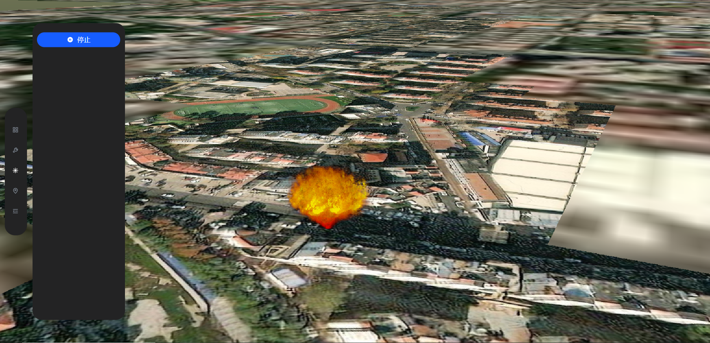

# Cesium常见功能集合

项目使用vue3+vite+cesium+arco.design搭建记录了学习cesium过程中实现的的一些常见功能。包括粒子特效、材质、量测工具、绘制工具等。具体功能如下所示。

## 项目启动

```
pnpm install
pnpm dev
```

## 功能（已完成）

- 基础设置

  - [X] 天空盒更换

    
  - [X] 地形数据加载
    
- 常用工具

  - [X] 量测工具(距离量测、面积量测)
    
  - [X] 绘制工具(点、线、面、矩形、圆)
    
  - [X] 指南针
    
  - [X] 缩放控件
    
  - [X] tooltip
    
- 粒子效果

  - [X] 下雨
    
  - [X] 下雪
    
  - [X] 雾天
    
  - [X] 火焰
    
- 打点

  - [X] primitive方式打点
    
- 模型

  - [X] 3dtiles贴模型取点
    